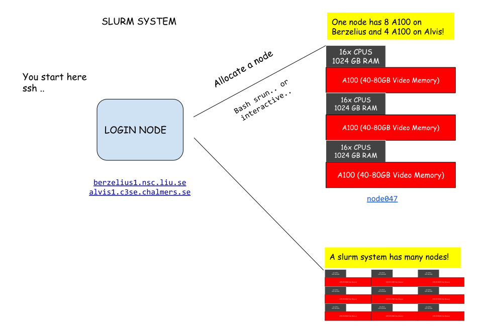

# Alvis and Berzelius starter guide

What is Alvis and Berzelius? They are supercomputers with many industry GPU:s installed for training neural networks. Please don't make our offices to saunas, it really pays off to learn to use them! 

If you feel bad about emissions etc, remember that these are tiny centers compared to the centers which trains huge LLM models,  it's really a rounding error. Despite this, as of 2026 AI share of total global emissions is around 0.5%. Sweden maintains one of the lowest carbon intensities in the world, the grid is approximately 99% fossil-free.


1. You start on your computer 
2. You use ssh to connect to the SLURM system. You are now in the login node in the slurm system. You can't use any GPU here.
3. You use a command to get a GPU node for 10 hours, for example `interactive --gpus=1 -t 10:00:00` on Berzelius or `srun -A NAISS2025-23-590 --gpus-per-node=A100:1 -t 10:00:00 --job-name=interactive --pty bash` on Alvis NAISS2025-23-590 is the project name.
4. Check that you have the gpu with nvidia-smi. 

All nodes have many GPUS! So remember you can run multi-gpu jobs that will give you immense power to train neural networks compared to your local station!




## 1. Apply  
Apply on this page: https://supr.naiss.se/. Click on Rounds > AL/ML Rounds. You can apply to Berzelius and Alvis at the same time. Filling out the forms is a little hassle, but you'll get there.

## 2. Log in to Berzelius with SSH  
You'll get a login username and password. You will need to download a 2FA app, for example, Google Authenticator, to log in. Open a terminal and run `ssh MY_USERNAME@berzelius1.nsc.liu.se` to check that you can get in with your password and 2FA. Exit the session with `Ctrl+D`. Check if you have a local ssh key in `~/.ssh/id_rsa.pub`, if not, generate with `ssh-keygen -b 4096 -t ed25519`. Finally, copy your ssh-key with `ssh-copy-id MY_USERNAME@berzelius1.nsc.liu.se`. You can now log in only using 2FA.  
Remember that you have two folders, your project folder (for example, `/proj/PROJECT_NAME`) and your home folder, `/home/MY_USERNAME`. Place things in your project folder, since it has more space, check with `nscquota`.  
Edit your ssh-config `~/.ssh/config` and add this:

```ssh-config
Host ber
  HostName berzelius1.nsc.liu.se
  User MY_USERNAME
  Port 22
```

You should now be able to log in just by writing `ssh ber` in the terminal.

## 3. Install dependencies with Apptainer and start Jupyter Lab  
Install dependencies, it's recommended to use Apptainer instead of Conda. Apptainer is tailored to make research easier to reproduce, all your dependencies will be installed in an image file "container". When you publish a paper, you can upload the code and data along with the Apptainer-image file to Zenodo. It's very similar to Docker, but tailored for running on HPC clusters like Berzelius.  
First, create a definition file and add the pip packages below. This installs Ubuntu in the image, Python3.9, and pip-packages into a virtual environment. Name it `recepie.def`.

```text
BootStrap: docker
From: ubuntu:22.04

%post
apt-get update -y
apt-get upgrade -y

DEBIAN_FRONTEND=noninteractive apt-get -y --no-install-recommends install \
  software-properties-common gpg gpg-agent g++ nodejs wget unzip zip vim \
  libpng-dev libjpeg-dev libtiff-dev libwebp-dev ffmpeg pandoc less \
  build-essential git curl \
  htop git-lfs

add-apt-repository -y ppa:deadsnakes

DEBIAN_FRONTEND=noninteractive apt-get -y --no-install-recommends install \
  python3.9 \
  python3.9-venv \
  python3.9-distutils \
  python3.9-dev

# Activate venv
python3.9 -m venv /opt/env
. /opt/env/bin/activate

python3.9 -m pip install --upgrade pip
python3.9 -m pip install --no-cache-dir opencv-python-headless \
  torch torchvision jupyterlab numpy matplotlib pandas \
  pillow scikit-image scikit-learn scipy seaborn tqdm natsort \
  imgaug h5py \
  timm pystackreg albumentations pynvml omnipose cellpose \
  segmentation-models-pytorch \
  ipywidgets==7.7.2 fvcore jupyterlab-code-formatter black isort \
  numpy transformers datasets requests nbconvert

rm -rf /var/lib/apt/lists/*
chmod -R o+w /opt
apt-get clean

%environment
. /opt/env/bin/activate
```

Build the Apptainer image:

```bash
apptainer build --fakeroot img.sif recepie.def
```

Execute a program inside it, for example, Jupyter Lab:

```bash
apptainer exec --nv img.sif jupyter-lab --ip 0.0.0.0
```

Now Jupyter lab should be running on the Server. You should see the port and URL, for example `berzelius1.nsc.liu.se:8888` in the output. Open another Terminal tab on your computer and start port forwarding:

```bash
ssh -NL ber 8888:berzelius1.nsc.liu.se:8888
```

You can now navigate to http://localhost:8888 in your browser and the Jupyter Lab will be running from the server.

## 4. Allocate GPU nodes  
When you log in to Berzelius with ssh you are located in a "Log-in" node. To get access to GPU you need to request a GPU node. You can either run it from your current terminal in interactive mode or dispatch a job. Login to berzelius and then run `interactive --gpus=1` to allocate a GPU. Then you can start JupyterLab from the container and do port forwarding. The url when running on the node will be something like: `node094:8888`.

## 5. Dispatch multiple batch jobs  
To dispatch multiple jobs and run them in parallel, you have to define a batch script that has a certain structure, see more at https://www.nsc.liu.se/support/systems/berzelius-gpu/. Multiple such scripts can be generated in a cell in Jupyter Lab:

```python
import os
import glob

job_folder = '/proj/MY_PROJECT/jobs'
pattern = os.path.join(job_folder, 'job-*.sh')
for filename in glob.glob(pattern):
    os.remove(filename)

for exp_settings in list_of_experiments:
    params_as_string = str(exp_settings)
    name = exp_settings['name']

    filestr = """#!/bin/bash
#SBATCH --gpus=1
RESERVATION_LINE
TIMERES_LINE
#SBATCH -o /proj/MY_PROJECT/logs/NAME.txt
#SBATCH -J NAME

echo 'Starting experiment: PARAMS_AS_STRING...'
apptainer exec --nv /proj/MY_PROJECT/img.sif python -u \
/proj/MY_PROJECT/experiment.py "PARAMS_AS_STRING"
"""

    # Create jobs
    job_path = os.path.join(job_folder, "job-NAME.sh")
    if not os.path.exists(job_path):
        with open(job_path, "w") as text_file:
            text_file.write(filestr)
    else:
        print('Path exists ' + job_path)
        raise 'error'

print('Generated ' + str(len(list_of_experiments)) + ' sbatch files')
```

And then you can add the below function to your `~/.bashrc` file to dispatch them all at once.

```bash
dispatch() {
  for file in /proj/ssfbac/jobs/job-*; do
    sbatch "$file"
    sleep 5
  done
}
```

These are other shortcuts I use and add in `~/.bashrc`:

```bash
# Show current running jobs you have dispatched
alias jobs="squeue -u $USER"

# Show GPU state
alias gpu="watch -n1 nvidia-smi"

# Allocate GPUS various reservations for 20 hours.
# Smallest
alias intsm="interactive --gpus=1 --reservation=1g.10gb -t 20:00:00"
# Medium
alias intmd="interactive --gpus=1 -t 20:00:00"
# Big
alias intlg="interactive --gpus=1 -C 'fat' -t 20:00:00"

# Start Jupyter Lab
alias jl="(cd /proj/MY_PROJECT && apptainer exec --nv img.sif jupyter-lab --ip 0.0.0.0)"
```
