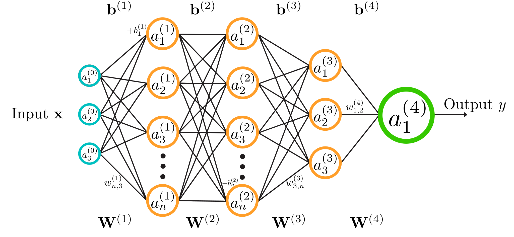
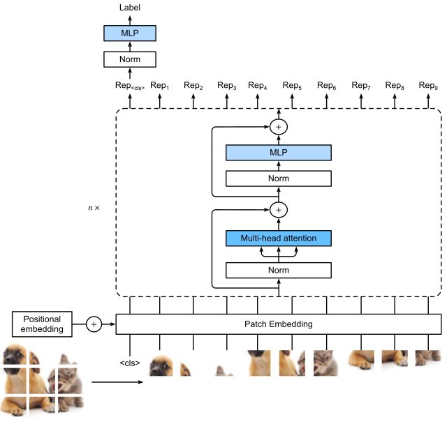

# Glossary

These are important concepts to know.

# Glossary

### Artificial Neural Network (ANN)

A model made of connected units called *neurons*, arranged in layers (input, hidden, output).  
The network learns to map inputs to outputs by adjusting connection strengths (*weights*) to reduce errors during training.

---

### Convolutional Neural Network (CNN)
A type of neural network designed for images and other grid-like data.  
It learns filters "*convolutions*" to detect patterns such as edges, textures. The image gets transformers into tensors subsampled but increases the number of channels during processing. It ends with global average poling of the final tensor and then a fully connected layer for class prediction.

---

### Vision Transformer (ViT)
A model that processes an image as a sequence of small patches.  
Each patch is treated like a token and processed using *self-attention*, allowing the model to capture relationships across the entire image. It outputs the same number of vectors as input patches, and a cls token to use for classification.

---

### Slurm

**S**imple **L**inux **U**tility for **R**esource **M**anagement.  
A job scheduler used on computing clusters. It assigns GPUs/CPUs to users’ jobs and manages the job queue.

---

### Supervised Learning

Training a model using input data paired with correct output labels (*ground truth*).  
The model learns by minimizing the difference between its predictions and the labels.

---

### Self-Supervised Learning

Training without manual labels. The model creates its own learning task (e.g., predicting missing parts of an image, "fill in the blanks") to learn useful representations before being used for a real task. 
Vision Transformers work remarkably well to do this!

---

### Learning Rate
A parameter that controls how large each update step is during training.  
Too large: unstable training. Too small: very slow learning. Start to tune this!

---

### Learning Rate Scheduler

A rule that changes the learning rate during training, usually decreasing it over time to allow more precise updates later. Typically use consine anealing with a linear warm up phase.

---

### Batch

A small subset of the dataset processed at once during training.  
Model updates are computed from this subset instead of the full dataset.

---

### Batch Size

The number of samples in one batch.  

---

### Normalization (Image, Batch, Layer)

Techniques used to standardize the inputs to a network or its intermediate layers, typically scaling data to have a mean of 0 and variance of 1.
* **Image Normalization/Channel Normalization:** Pre-processing step scaling pixel intensity values. (Typically separate for each channel). Can also be done on tensors between layers.
* **Batch Normalization:** Normalizes activations across the batch dimension (using the mean/variance of the batch).
* **Layer Normalization:** Normalizes activations across the feature dimension for a single sample, independent of other samples in the batch.

---

### Weight Decay

A regularization technique that adds a penalty to the loss function based on the magnitude of the model's weights (typically the L2 norm). By penalizing large weights, it prevents the model from relying too heavily on any single feature, reducing the risk of overfitting.

---

### Augmentation

Creating modified versions of training images (rotations, flips, crops, color changes) to increase data diversity without changing labels.

---

### Gradient Descent

An iterative optimization algorithm used to minimize the loss function by moving the model parameters in the opposite direction of the gradient.

* **Stochastic Gradient Descent (SGD):** Updates weights based on gradients computed from a small subset of data (the batch)
* **ADAM:** An adaptive optimization algorithm that adjusts learning rates for individual parameters using estimates of the first and second moments of the gradients.

---

### Loss Function
A mathematical function that quantifies the difference between the model's predicted output and the actual target value. The training process aims to minimize the value of this function (e.g., Cross-Entropy Loss for classification, Mean Squared Error for regression).

