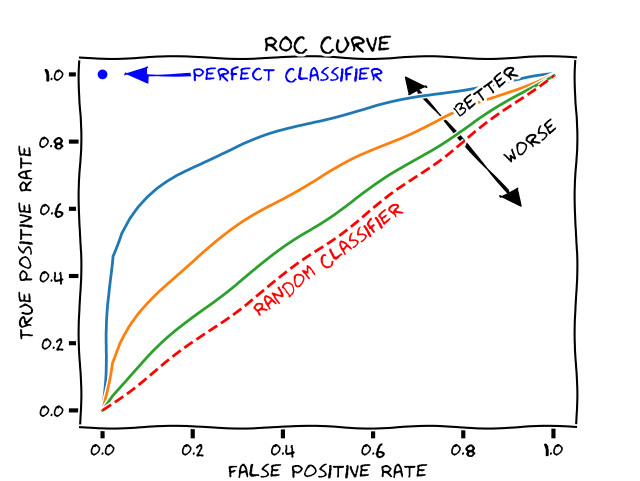
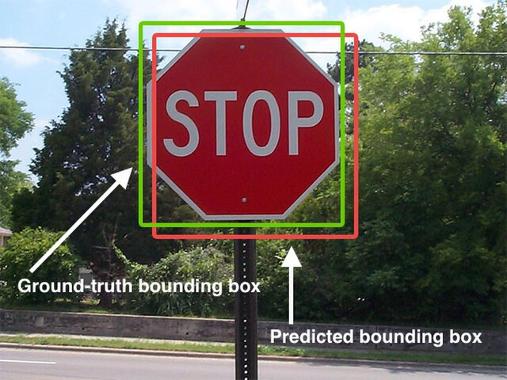

# Validation Metrics
It is important to use a good metric to validate model performance. Typically you train on a training set and test on a test set. You can use a validation set to tune the model, and do early stopping etc.

## Classification
The goal of the model for classification is to output a single class given an input.

Either you have 2 classes, binary problem, for example positive/negative, cat/dogs or you have >= 3 classes output, then it its called "multiclass" problem.

### Confusion matrix
A table visualizes the performance of the algorithm. Go trough each test outputs one by one, choose the row based on the true label and the column based on the predicted label and increment the value in the cell. All the samples that are correctly predicted will end up on the diagonal. 

*Example*
You are training a neural network that is trained on images of elephants, cars and trees (3 classes).  In the testset there are 40 images, 10 of cars, 25 elephants and 5 trees.
Classifier output after traing for the test set is shown in the confusion matrix:

| | 🚗 Predicted Car | 🐘 Predicted Elephant | 🌳 Predicted Tree | **Total in testset** |
| :--- | :---: | :---: | :---: | :---: |
| **🚗 Car** | **8** | 2 | 0 | 10 |
| **🐘 Elephant** | 8 | **16** | 1 | 25 |
| **🌳 Tree** | 0 | 1 | **4** | 5 |
| **Total Predicted** | 16 | 19 | 6 | **40** |

---

**Precision**
Computed over all *prediction on a class*. Number of correct predictions, divided by the total predictions on that class. One for each *column* on the confusion matrix.
*Example: You have 16 predicted cars in the testset, but only 8 of the predictions are correct, Precision for car $8/16 = 50%$.* Memory rule: "P" **P**recision looks at the **P**redictions of a particular class.
> How precise are your car predictions? 

**Recall (Sensitivity)**
Computed over all *instances of a class*. Number correctly classified instances of a class divided by the total instances of that class.
*Example: You have 10 cars in the testset, 8 are classified correctly, Recall for car  $8/10 = 80$%.* Memory rule: "I" Recall/Sens*i*tivity looks at all *i*nstances of a particular class.
> How many of all cars did you recall?

**F1 Score**
The harmonic mean of Precision and Recall. You can trade precision for recall, for example if the classifier output all cars, recall for car is high, but percision is low. This takes both into accout.

$$
F1 = 2 \times \frac{Precision \times Recall}{Precision + Recall}
$$

For a multiclass problem you have one precision and one recall and one F1-score for each class! 

**Macro-Average**
Computes the metric independently for each class and then takes the average (treating all classes equally). For exampel you measer precision/recall/f-score for all classes in the multi class problem, sum and divide by number of classes.

**Accuracy**
Accuray is looking at all samples in the testset regardess of class, the number of correctly classified samples divided by the total samples.
*Example: In the confusion matrix above it is the sum of the diagonal divided by the size of the testset $(8+16+4)/40 = 72.5%$*

**Top-k Accuracy**
The fraction of samples where the correct label is present in the top *k* predicted probabilities. Common values are Top-1 and Top-5. Typical for large networks with 1000-class output.

**Binary True/False problem**
Sometimes you have a classifier that only outputs true or false, then the confusion marix will be only 2x2 like this:

| | ❌ Predicted False | ✅ Predicted True |
| :--- | :---: | :---: |
| **❌ False** | **55 (TN)** | 5 (FP) |
| **✅ True** | 10 (FN) | **30 (TP)** |

The double negations can be a bit confusing, but it's true negative (TN) and true positive (TP) on the diagonal, and misclassifications in false positive (FP) and false negative (FN). The definitins are then a bit different precision and recall refers to the positive class, and the others have different names.

- **Negative Predictive Value (NPV)**: $$\mathrm{Precision_{False}} = \frac{55}{55 + 10} \approx 84.6\%$$
- **Precision**: $$\mathrm{Precision_{True}} = \frac{30}{30 + 5} \approx 85.7\%$$
- **Specificity**: $$\mathrm{Recall_{False}} = \frac{55}{55 + 5} \approx 91.7\%$$
- **Recall**: $$\mathrm{Recall_{True}} = \frac{30}{30 + 10} = 75.0\%$$

### AUC Reciever operating characteristics
In deep learning you typically have a vector output that has the number of classes, each component in the vector has the score for that particular class, normalized so the vector sum to one. You take the class with the highest score as final output. For binary problems you can instead classify positive when the score is above 0.5 (the negative class must be smaller than that). But what if you instead set the threshold for positive score to 0.1, despit the negaive scor being higher then many more in the testset will be taken as positive and you would have higher recall or sensitivity. Opposite if you put the threshold at 0.9 you will have much fewer samples classified as positive,  (the classifier has to be really sure before it flags a test sample as postive) and that will be higher precision. Let's make some definitions: **True Positive Rate (TPR)** = Recall (Recall_True) and **False Positive Rate** = 1- Specifity (Recall_False).

This can perhaps be a bit confusing, instead say we only look at the positive classifications of the model

- $$ \text{True Positive Rate} = \frac{\text{Number of positive predictions}}{\text{Total number of positive Samples in the test set}} $$

- $$ \text{False Positive Rate} = \frac{\text{Number of errornously positive predicitions that where in fact negative}}{\text{Total number of negative samples in the test set}} $$

What you do then is the following: Set the threshold for positive to 1.0. You will have zero positive classifications, so TPR and and FPR will both be zero. Now set the threshold to 0, you will classify all samples as positive, your TPR will be 1 (you will recall them all) but all negatives will be classified as positive so FPR will be one. Interpolate the threshold to 0.1, 0.2, 0.3 etc and make the evaluations repeatedly for each treshold. You will se as the TPR goes up, FPR will also slowly start to increase. But you ideally want TPR to increase without FPR increasing. That is the ideal classifier! It outputs 1 for all positive samples and 0 for all others and it is completely sure!

In the picture above positive threshold = 1 corresponds to the bottom-left corner and threshold 0 corresponds to the top-right corner. 

**Random classifier**
What if all the classifier just outputs is 0.5 regardless of input? At threshold 0-0.5 it will stay in the lower left corner (TPR = 0, FPR = 0). As soon as the threshold hits 0.5 it all samples will be classified as positive, TPR = 1 and FPR = 1. Draw a line between this points and you will have the y = x, and it will be a random classifier, have no info.

**Area under the curve**
If you measure the area under this curve it's a good measure to know how good the classifier is. A perfect classifier has area 1 and the random classifier is 0.5.

### Regression

The goal of a regression model is to output a real-valued number.
Let $ y_i $ be the true value, $ \hat{y}_i $ the prediction, and $ n $ the number of samples, and $i$ sample index in the test set.

**MAE (Mean Absolute Error)**
The average of the absolute differences between predictions and actual values in the testset. Less sensitive to outliers than MSE.
$$
\mathrm{MAE} = \frac{1}{n}\sum_{i=1}^{n}\left|y_i - \hat{y}_i\right|
$$

**MSE (Mean Squared Error)**
The average of the squared differences between the predicted and actual values. By squaring the errors, this metric penalizes larger errors more severely than smaller ones.
$$
\mathrm{MSE} = \frac{1}{n}\sum_{i=1}^{n}\left(y_i - \hat{y}_i\right)^2
$$

**RMSE (Root Mean Squared Error)**
The square root of the MSE. It measures the standard deviation of the residuals. It is interpretable in the same units as the response variable.
$$
\mathrm{RMSE} = \sqrt{\frac{1}{n}\sum_{i=1}^{n}\left(y_i - \hat{y}_i\right)^2}
$$

### Object detection
The goal of an object detection model is to detect objects and put bounding boxes around each found object in a model. Each test sample then have a list of bounding boxes with four coordinates.

# 

**IoU (Intersection over Union)**
Measures the overlap between two boundaries (the predicted bounding box and the ground truth bounding box). It is calculated as the area of overlap divided by the area of union.

**AP (Average Precision)**
The area under the Precision-Recall curve for a single class.

**mAP (Mean Average Precision)**
The average of the AP values calculated for all classes. It is often reported at specific IoU thresholds (e.g., mAP@0.50 means mAP calculated with an IoU threshold of 0.5). COCO mAP typically averages over IoU thresholds from 0.5 to 0.95.

### Feature visualization
PCA

### Segmentation

**Pixel Accuracy**
The percentage of pixels in the image that are correctly classified. While intuitive, it is not a reliable metric when class labels are heavily imbalanced (e.g., small objects on a large background).

**Dice Coefficient (F1 Score for Segmentation)**
A statistic used to gauge the similarity of two samples. It is calculated as 2 * (Area of Overlap) / (Total number of pixels in both images). It penalizes false positives and false negatives equally.

**Jaccard Index (IoU for Segmentation)**
Similar to the Dice coefficient but penalizes errors more severely. It is calculated as (Area of Overlap) / (Area of Union).

