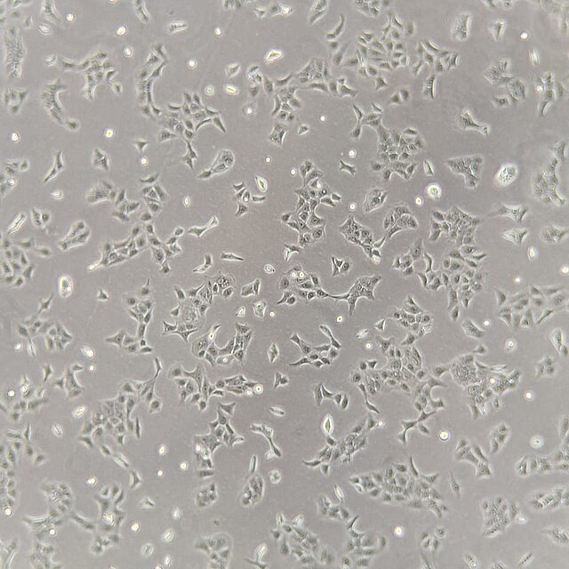
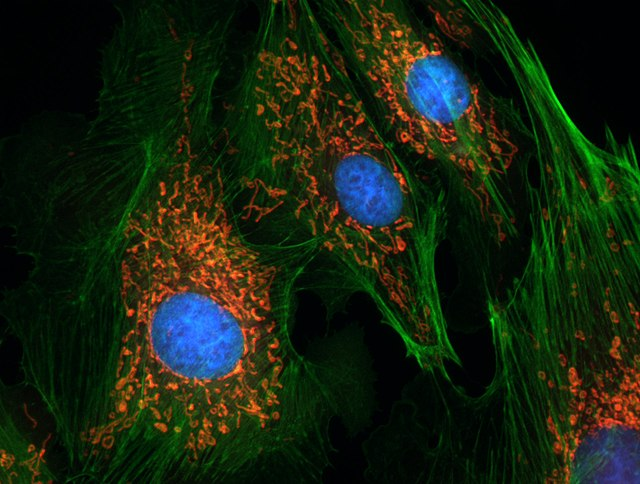
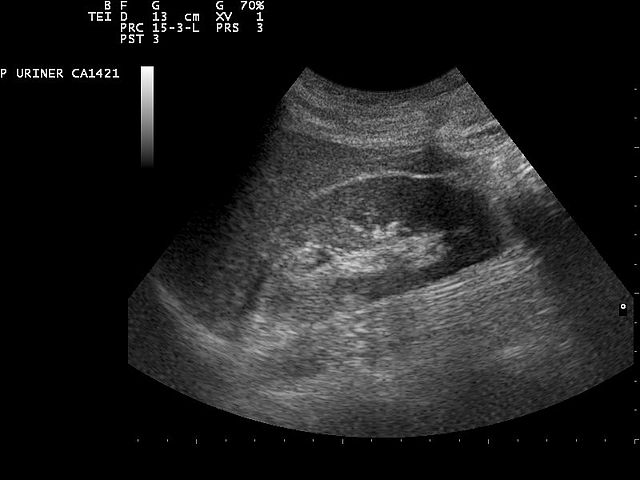

# Introduction
Congratulations on your PhD position in image processing! Here are some important things to know as of 2026

   

## Quick tips

1. **Look at the data!** What do the images look like? Look at a couple for each experiment. Any differences?
2. **Learn neural networks** Learn to understand and use neural networks, they produce the best results today for analyzing what's in an image. You can learn from your data!
3. **Finetune** Other people can pretrain the networks for you, then you don't have to train yourself! Often you don't need much data at all for fine-tuning.
4. **Label data** Don't be afraid to spend a little time to manually label data and curate your data. You can let the network generate fuzzy labels on a subset and then correct the labels by looking at misclassifications.
5. **Start small - iterate faster** Spatially downsample the image data, start with a smaller model, train and test with a subset of the data. That will go much faster and you will have feedback on how to continue. But don't forget that neural networks scale with data and size, but it has to be good varied data!
6. **Classical image processing** Don't forget classic image processing, but if you end up trying to solve a problem tweaking parameters, and introduce more logic, drop it! It's easier to program with data (training neural networks) automatically tweaking millions of parameters than tweaking 30 parameters in your classical image processing pipeline.
7. **Use agents** You try to investigate the research problem and use agents for coding, Claude Code, Cursor or Antigravity, Codex etc (as of 2026).

**Final tips:**
Please don't make our offices into saunas!  Never train on your laptop or local computer, learn to use SLURM systems Berzelius and Alvis!

